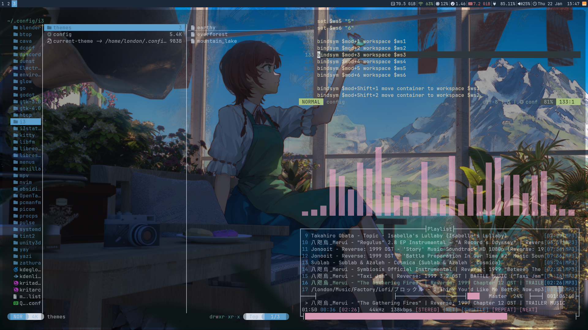
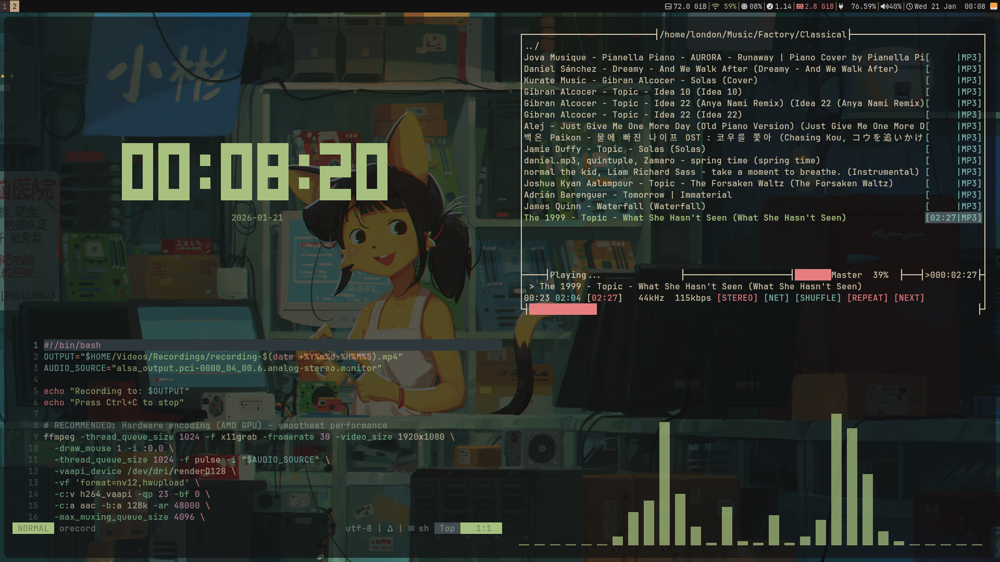
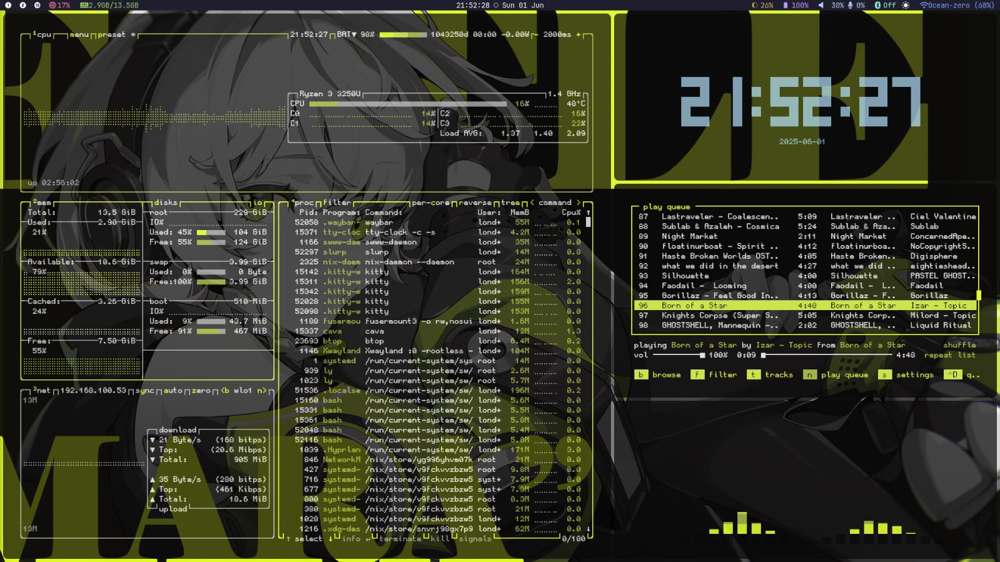
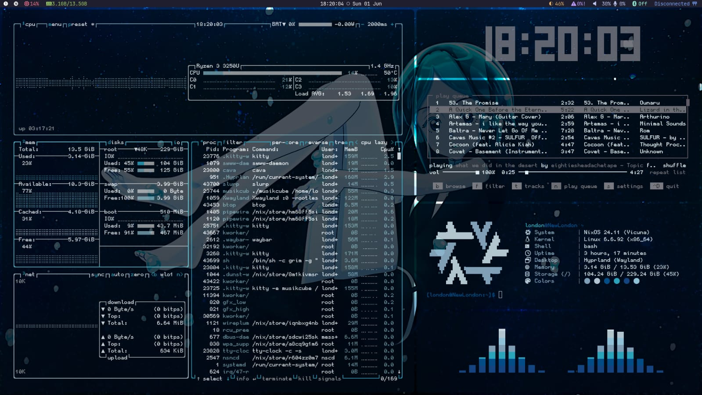

# 4e_dotfiles

My personal Linux dotfiles for various window managers and desktop environments. 

## 🖥️ Window Managers

This repository contains configurations for:

- **i3** - Lightweight tiling window manager
- **bspwm** - Binary space partitioning window manager  
- **Sway** - i3-compatible Wayland compositor

## 📦 What's Included

Each configuration includes setups for:

- Window manager configs
- Terminals
- Status bars
- Compositors
- Application launchers
- Hotkeys
- Custom scripts

## 🎨 Themes & Rice

### i3 Configuration


<p align="center">
  
  
</p>

Clean, minimal setup with a focus on productivity and aesthetics.

### Sway Configuration


<p align="center">
  
  
</p>

Clean, minimal setup with a focus on productivity and aesthetics.

## 🚀 Quick Start

1. Clone this repository:
```bash
git clone https://github.com/4eLondon/4e_dotfiles.git
cd 4e_dotfiles
```

2. Choose your window manager and copy the configs:
```bash
# For i3
cp -r i3Dots/* ~/.config/

# For bspwm
cp -r bspwmDots/* ~/.config/

# For Sway
cp -r swayDots/* ~/.config/
```

3. Make scripts executable:
```bash
chmod +x ~/.config/*/script/*
```

4. Restart your window manager or log out and back in.

## 📝 Note

These are my personal configurations. Feel free to use them as inspiration or a starting point for your own setup. Adjust keybindings, colors, and settings to match your preferences.
