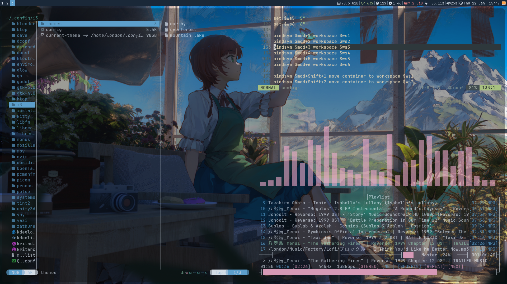
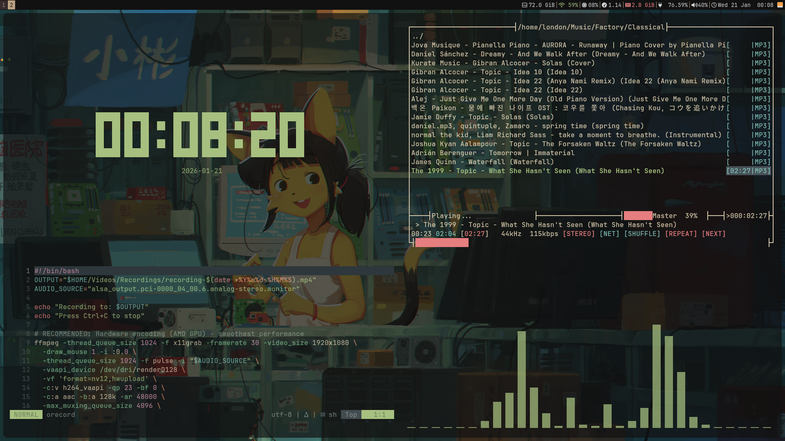
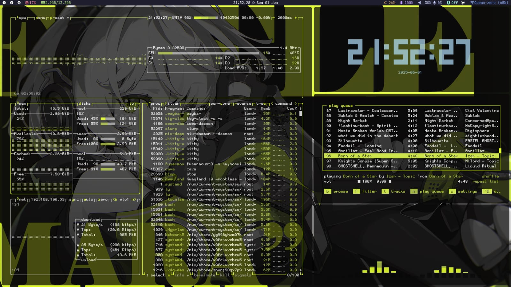
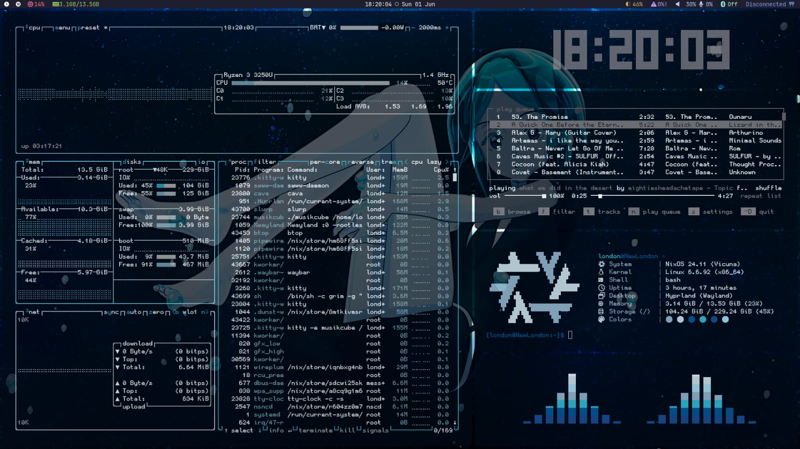
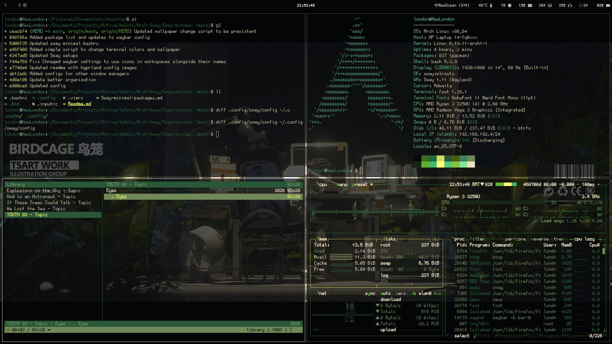
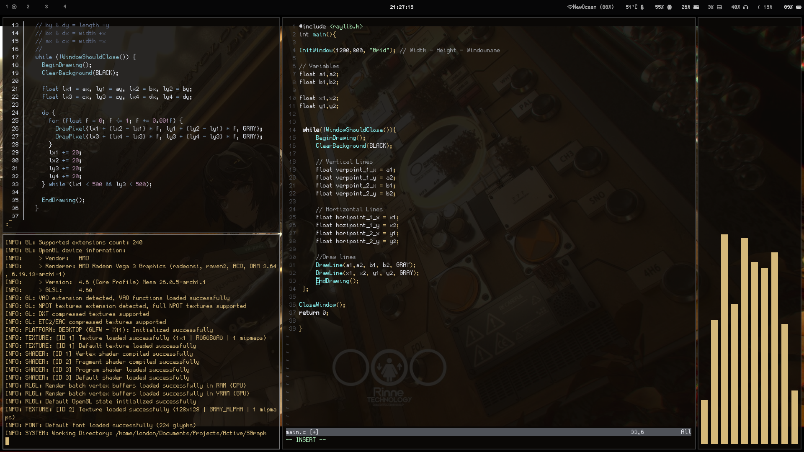
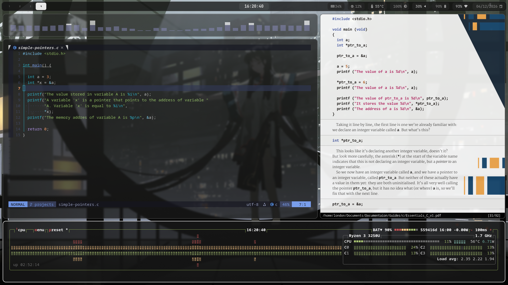
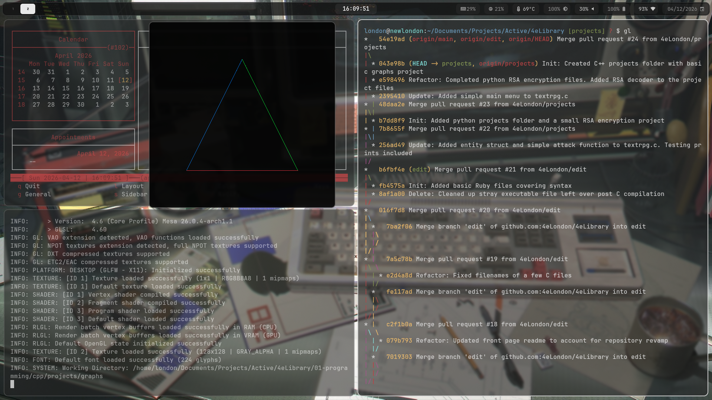

# 4e_dotfiles

My personal Linux dotfiles for various window managers and desktop environments.

## 🖥️ Window Managers

This repository contains configurations for:

- **i3** - Lightweight tiling window manager
- **bspwm** - Binary space partitioning window manager
- **Sway** - i3-compatible Wayland compositor

## 📦 What's Included

Each configuration includes setups for:

- Window manager configs
- Terminals
- Status bars
- Compositors
- Application launchers
- Hotkeys
- Custom scripts

## 🎨 Themes & Rice

### i3 Configuration

  
  

### Sway Configuration

  
  
  
  

### Hyprland Configuration

  
  

| Window Manager | Protocol | Idle RAM | CPU Usage | GPU Usage | Notes |
| :--- | :--- | :--- | :--- | :--- | :--- |
| **i3** | X11 | ~15–26 MB | Very Low | Negligible | Mature, stable, minimal resource footprint. Best for older hardware. |
| **bspwm** | X11 | ~15–20 MB | Very Low | Negligible | Extremely lightweight, scriptable via shell. No built-in bar/keybinds. |
| **Sway** | Wayland | ~40–60 MB | Low | Low | i3-compatible config. Stable, efficient, native Wayland support. |
| **Hyprland** | Wayland | ~80–150 MB | Moderate | High | Animated, modern features. Higher GPU/CPU overhead due to effects. |
| **labwc** | Wayland | ~30–50 MB | Low | Low | Openbox-like stacking WM. Lightweight and uses wayland. |

